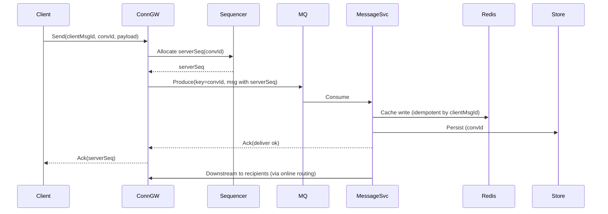

### 亿级在线 IM 系统架构设计（可动态伸缩 / 高可用 / 高并发）

- **目标**: 支撑 1 亿在线连接、千万级并发消息、毫秒级延迟、可全球多活、随业务峰值自动扩缩。
- **约束**: 强一致仅在会话内（per-conversation strict order），跨会话最终一致；移动端弱网适配；成本可控。

---

### 总体架构（高层）
```mermaid
flowchart LR
  Client[Mobile/Web/PC] -- TLS/WS/QUIC --> EdgeGW(Anycast/Edge GW)
  EdgeGW -- WS/TCP --> ConnGW[Connection Gateway (Go, kqueue/epoll)]
  ConnGW -- RPC/gRPC --> Sess[Session/Presence]
  ConnGW -- Pub/Sub --> MQ[(Kafka/Pulsar)]
  ConnGW -- RPC --> Seq[Sequencer (per-conv partitions)]
  MQ --> MsgSvc[Message Service]
  MsgSvc --> Cache[(Redis Cluster)]
  MsgSvc --> Store[(MySQL/TiDB/Cockroach/Scylla 分片)]
  Sess -- Pub/Sub --> Online[Presence/Subscription]
  MsgSvc --> Push[Push (APNs/FCM/厂商通道)]
  Admin[Admin/API] --> Ctrl[Control Plane (K8s/Etcd/Consul)]
  Obs[OTel/Prom/Grafana/Jaeger] --- ConnGW
  Obs --- MsgSvc
  DR[Cross-Region DR/GeoDNS] --- EdgeGW
```

---

### 关键设计要点

- **接入层（Edge/ConnGW）**
  - **协议**: WebSocket/TCP，移动端优先 WS；探索 QUIC 作为备选。
  - **连接密度**: Go `netpoll` + `SO_REUSEPORT`；单节点 20–60 万稳定连接（kqueue/epoll），1U 可扩至 >100 万。
  - **TLS 终止**: 边缘层（Envoy/Nginx/Cloud LB）+ Anycast/BGP/Global Accelerator。
  - **粘性路由**: 连接只在 GW 层粘性；业务层完全无状态。

- **会话与路由（Session/Presence）**
  - **Rendezvous Hash（HRW）** 或一致性哈希，key = `userId`/`convId`，支撑动态扩缩容。
  - Session 存放 Redis Cluster（主存），短期断点可重建；长期快照冷备到存储。

- **消息有序与投递**
  - **分区顺序**: 按 `conversationId` 做分区（Kafka/Pulsar `key = convId`），每分区单写有序。
  - **Sequencer**: 每会话唯一递增 `serverSeq`；读写采用 “读你所写”(RYW) + 去重。
  - **投递语义**: 至少一次（at-least-once）+ 去重（`clientMsgId` 幂等键）；必要场景支持“恰好一次”感知。

- **存储层**
  - **冷热分离**: 最近 7~30 天在 Redis + 热表（MySQL/TiDB/Scylla）；更久归档到对象存储/冷表。
  - **模式**: 按 `convId` + 时间分区/分表；读走 `serverSeq` 游标分页。
  - **行键**: `convId#serverSeq`，避免热点；二级索引最小化。
  - **WAL/CDC**: 通过 MQ 做消息日志，消费侧入库，容灾与回放统一。

- **在线状态 / 订阅**
  - 粗粒度在线（online/away/offline）+ 订阅关系（watch list），通过 Redis Pub/Sub/NATS，就近推送边界节点。
  - 防抖+采样（如 1s 聚合）避免风暴。

- **推送（APNs/FCM/厂商）**
  - 异步队列 + 幂等去重 + 失败重试指数退避；夜间静默策略与批量合并。
  - Token 刷新与厂商维度速率限制。

- **伸缩与编排**
  - K8s + HPA/VPA（CPU、内存、qps、lag、连接数自定义指标）。
  - 业务服务无状态，连接网关有状态但可水平扩；会话路由用一致性哈希避免大规模迁移。

- **高可用与灾备**
  - 多 AZ 部署，跨 Region 异步复制；RPO ≤ 数秒，RTO ≤ 分钟。
  - 流量调度：GeoDNS + Anycast，Region 熔断与灰度发布。
  - 数据层：MySQL/TiDB 主从/多主，Redis Cluster 哨兵/Proxy 模式，MQ 多副本 ISR / BookKeeper。

- **一致性 / 幂等 / 去重**
  - 幂等键：`clientMsgId`（客户端生成，带时间/随机/设备签名）。
  - 存储唯一约束防重；消费端利用 bitmap/bloom/缓存短期去重。
  - 会话内严格顺序，跨会话最终一致；读取遵循 `serverSeq`。

- **安全**
  - 双向 TLS（可选）/TLS1.3，短期 JWT + 设备指纹；服务间 mTLS（SPIFFE/SPIRE）。
  - 频控/漏桶/令牌桶、WAF/DDOS 防护、灰黑名单。
  - 审计日志与敏感字段加密（KMS）；隐私隔离（多租户/国别合规）。

- **可观测性**
  - OpenTelemetry 全链路，Prometheus 指标，Grafana 看板，Jaeger Trace。
  - 关键 SLI/SLO：连接建链成功率、消息端到端 P99、丢重率、存储写入延迟、MQ Lag。

---

### 性能与容量估算（示例）

- **在线连接**: 1e8 在线；若单 ConnGW 承载 30 万连接，需 ~334 台；预留 30% 冗余 → ~440 台。
- **消息速率**:
  - 峰值上行 5M msg/s，广播/群聊放大后下行 20–50M msg/s。
  - Kafka: 以 2MB/s/partition、P99<10ms 为目标，按 key=convId 分区：需要 3k–10k 分区（多集群分域）。
- **Redis**:
  - 在线/会话与热点消息缓存：QPS 1000万级，建议 30–60 分片，主从/Proxy。
- **存储**:
  - 热数据 30 天：按 100B/msg、30e9 msg/day ≈ 3TB/day，30 天 90TB，冷热分层+压缩。

---

### 核心数据模型（简要）

- **Message**
  - `serverMsgId`（全局或分会话唯一）、`clientMsgId`、`convId`、`from`、`to[]`、`serverSeq`、`timestamp`、`payload`、`type`、`bizAttrJSON`
- **Conversation**
  - `convId`、`type`（C2C/Group/Channel）、`participants`、`lastServerSeq`、`lastMsg`
- **Receipt/ACK**
  - `userId`、`convId`、`readSeq`、`deliverSeq`、`timestamp`
- **Presence**
  - `userId`、`state`、`device`、`since`

---

### 关键流程（序列图）



---

### 技术选型建议（可替换）

- **语言**: Go（ConnGW/服务端核心），Rust/C++ 可用于极限网关。
- **MQ**: Kafka（低延迟/高吞吐）或 Pulsar（存储分离/地理多活更友好）。
- **缓存**: Redis Cluster（Twemproxy/Redis Cluster Proxy/KeyDB）。
- **持久化**: 
  - 关系型（MySQL/TiDB/Cockroach）分片分区，强一致交易、检索。
  - 宽表/列存（ScyllaDB/Cassandra）高写入与 TTL 冷热分层。
- **服务治理**: Kubernetes、Istio（mTLS/灰度/金丝雀）、Consul/Etcd。
- **边缘**: Anycast+BGP、Cloudflare Spectrum/自建边缘。

---

### 伸缩策略（实操要点）

- **ConnGW 水平扩容**: 以连接数、自定义指标（活跃连接/建链速率）触发 HPA；Rendezvous Hash 降低迁移。
- **MQ 分区扩容**: 按 convId 的分布热度重分区/多集群分域（用户分片/国家维度）。
- **存储扩容**: 按 convId+时间切分，冷热表与 TTL；在线 DDL 与影子表迁移。
- **消息风控**: 限制大群广播频率、开启批处理/合并、端侧折叠。

---

### 可用性与故障处理

- **单 AZ 故障**: 通过 GeoDNS 拉流量，ConnGW 无状态快速再热；MQ/Redis/DB 副本切换。
- **跨 Region 故障**: 双活/多活；用户按地理归属在本地 Region 首选；会话可跨区但路由优选本地。
- **数据回放**: 以 MQ/WAL 为准，缺失数据可回放至存储恢复一致。

---

### Go 项目结构建议（示例）
